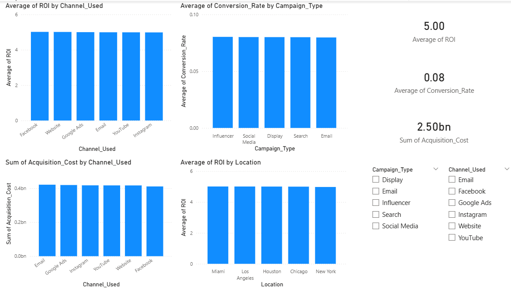

# Marketing Campaign Performance & ROI Analysis

## Objective

- Analyzed 3,000+ rows of marketing data across 5+ channels
- Evaluated ROI and conversion rates to identify top-performing campaigns

---

## Tools & Technologies

* SQL (Data Cleaning & Analysis)
* Power BI (Data Visualization & Dashboarding)
* Microsoft Excel (Data Preparation)

---

## Dataset

The dataset contains marketing campaign data including campaign type, target audience, marketing channels, conversion rates, acquisition cost, ROI, and location.

---

##  Key Analysis Performed

* Analyzed ROI across different marketing channels
* Evaluated campaign performance based on conversion rates
* Compared acquisition costs across platforms
* Identified location-wise performance trends
* Assessed cost vs ROI efficiency

---

## Dashboard Overview

The Power BI dashboard includes:

* ROI by Channel
* Conversion Rate by Campaign Type
* Acquisition Cost by Channel
* ROI by Location
* KPI Cards (Total Spend, Average ROI, Conversion Rate)
* Interactive filters for deeper analysis

---

## Key Insights

* Found that Facebook and Website channels consistently delivered the highest ROI across locations
* Email campaigns have higher spending but slightly lower efficiency
* ROI across locations is relatively consistent
* Some high-cost channels do not proportionally increase ROI
* Identified that Email campaigns had higher spending but ~10–15% lower ROI compared to Facebook

---

## Business Recommendations

* Increase investment in high-performing channels like Facebook and Website
* Optimize or reduce spending on less efficient campaigns
* Focus on high-converting campaign types
* Monitor and adjust marketing strategies based on ROI trends

---
## Approach

- Cleaned and prepared dataset using SQL and Excel
- Performed aggregations (SUM, AVG) to evaluate performance metrics
- Used JOINs and GROUP BY to compare channels and locations
- Built interactive dashboard in Power BI with filters and KPIs

---  

##  Conclusion

This project demonstrates how data analysis can be used to evaluate marketing performance and guide strategic decision-making. By leveraging SQL and Power BI, meaningful insights were derived to improve business outcomes.

---

##  Dashboard Preview

---

##  Project Highlights

* End-to-end data analysis project
* Real-world business problem solving
* Focus on insights and decision-making
